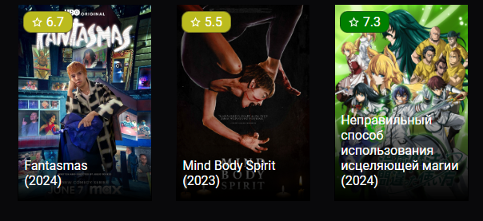
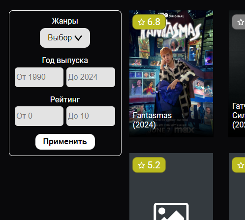
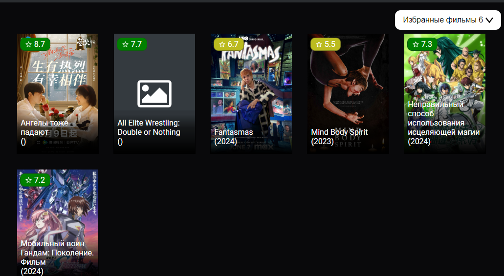

# Много страничное React приложение "КиноИнформация"
Для просмотра "КиноИнформация" можно:
1. Просмотреть его на самом гитхаб. [github-pages](https://volffs.github.io/cinema-information/). Максимум 200 запросов в день
2. Запустить его на своём устройстве.

### Запуска на своём устройстве:
Для работы приложения необходимо получить ключ для Api ["Кинопоиск API"](https://kinopoisk.dev).

Ключ можно получить здесь: https://kinopoisk.dev

Чтобы запустить "КиноИнформация" нужно:
1) Скачать репозиторий.
2) В папке с репозиторием создать `.env` файл и создать переменную окружения. Пример можно просмотреть в файле `env-examle.txt`.
```
VITE_API_KEY="Ваш Ключ"
```
3) Установить все зависимости. `npm install`
4) Запустить React приложение. `npm dev`


## Представление "КиноИнформация"

React приложение "КиноИнформация" представляет собой многостраничное приложение с возможностями поиска кино по фильтрам и просмотра их описания и последующим добавления в избранное.

### Для каждого фильма на главной странице предоставлена информация:
1. Постер
2. Название
3. Год выпуска
4. Рейтинг



### При переходе на фильм будет доступна информация:
1. Постер
2. Название
3. Описание
4. Рейтинг
5. Дату выхода
6. Список жанров
7. Актёры


### Для поиска чего конкретного пользуйтесь фильтром.

И найдите что-нибудь себе по душе и не стеснйтесь.



### Понравившееся фильмы можно добавить в избранное.

Просмотреть избранное кино можно на отдельном окне.



**Не бойтесь потерять их они сохранятся у вас в браузере!**
